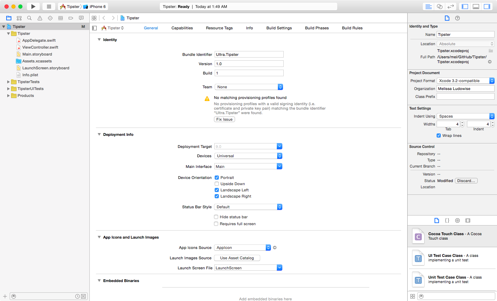
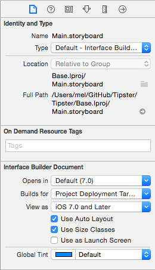
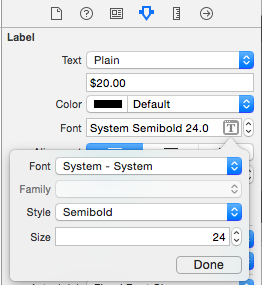
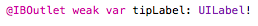
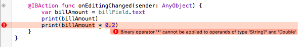
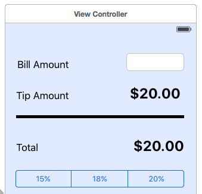
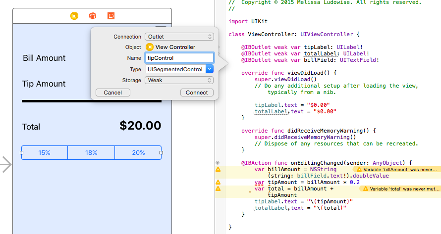
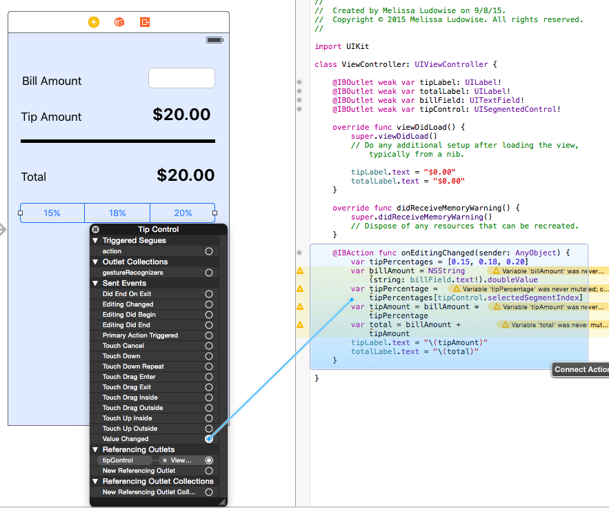

Goal of the Tip Calculator is not to learn everything detail of the app we are building and why we are making each choice, but to get the feel of how this works. Introducing XCode, general workflow of implementing a design, the concept of IBActions & IBOutlets.  

Teacher tips:
* Tim Lee has a good metaphor for not getting hung up on the syntax.  He asks how many people took Spanish (or another language in high school).  Then he advises: “Put your Spanish reading hat on” Just gloss over  the words that you don't understand.  Instead try to just get the idea of the meaning.
* Don’t answer detailed questions.  (You can put them on the whiteboard to answer later if they feel like something you want to address later.)  Reiterate that the goal is to understand the core patterns -- the things you will do in every iOS app you build.
* Always demo a well-designed app first.  Tell students that they will need to have product and design sense more often as an iOS developer than other disciplines.

# Demo
Show the app you will build, plus another similar app with a really great user experience -- point out how the core is the same but the look and feel can be custom.

→ Tabber
* keyboard visible by default, don’t bother with actual stuff until after entering other stuff
* “Enter bill” pulse
* instead of percentages - good service, fair, bad


# Make a Project
File > New > Project

You will always, 100% of the time, choose Single View application


Select "Swift" under Language




# Designing the view (15-20 mins)

What you will learn:
* labels
* text views
* UI View - just like a div in HTML
* segmented control

## Quick Tour of XCode
Upper left:
* Play / Stop buttons
* Ability to select which simulated phone to run on (or your real phone)
* Menu next to your app name: 
* Choose iPhone 5, easy small demo


* You can see my phone is named...  Your phone might say “trust this” you should say "ok"

   Note: deployment target, might need to change that if you iOS app doesn’t match
   

For now, just run on Simultaor, by clicking on the play button in the upper-left of the window

Here's your app!  (Show running in simulator) Just a white screen since we haven't added anything yet.  It is good to be in the habit of running your app a lot, every time you make a small change, so you can catch errors quickly.

## Let's keep going

On the left side, I can see a bunch of different files:
* Assets (select it) is going to be where I’m going to put all of my images.  For example, if you want to set an app icon.  You can drag in the appropriate app icon, so it will show up on the home screen.

Then show in the top-right area, how you can collapse the properties pane on the right so there is more room to see all the app icons.

Storyboard
Storyboard -- when you think about the application, you think about how many views the app has

Select the main storyboard (Main.storyboard) -- notice that it is square.


There are no square iOS devices, but this is Apple’s way of hinting that devices in the future may be any size so they really want you design & build for arbitrary dimensions.

Right now, for this app, we’re going to just design for portrait iPhone layout, just so you get experience with the basics of hooking up UI elements.

Click on the screen, then on the document icon in the properties panel.


### Turn off auto-layout
Right now, for this app, we’re going to just design for portrait iPhone layout, just so you get experience with the basics of hooking up UI elements.

Turning off auto-layout requires turning off size classes

Click on the big rectangle in the middle of the screen, then on the right side of the screen, click on the document icon in the properties panel.

Uncheck "Use Auto Layout"


A dialog box will appear, click "Disable Size Classes"


Now the document properties panel should look like this:


and the storyboard layout will look like an iPhone:


## Introduce Properties: set background color
I’ll start by setting some properties on the canvas.

### Properties:  
For the longest time I thought this was a shield, but it’s actually supposed to represent a slider, so you can remind you that it is for setting various values that affect whatever view is selected.  so, let’s just set the background color

If needed, select Main.storyboard


Then select the view

Choose a background color


## Lay Out UI Elements
Now, I’m going to start building out my views.  Just to remind you, here’s the vanilla tip calculator that I’m going to build... (show finsihed app)

You always start in iOS development with just making the static views.  This is a one screen application, but even if I had multiple screens I would just do one screen at a time.  Then for each screen I lay out the elements that are in that screen.

Type "label" into the lower-right panel:


Option, click-drag to duplicate elements, just like a lot of other visual design apps.


Click T - Show how we can change fonts: make it systemBold
Make font bigger, right justify, etc. show



Command = - size to fit


Option, click-drag to duplicate


Now let's add an editable text field.  Type "text" into the box on the lower-right:


Run the app...


When we want to draw simple lines or areas of color, we just use a UIView:


Show how it can be resized and then set background color to make it look like a line:


### Keybaord

Hit play really frequently -- easier to catch on a problem early on
If you aren’t hitting play every five minutes, something is going wrong

Make sure the keyboard comes up when you click into the keyboard


If not:
Hardware > Keyboard > Toggle Software Keyboard
command 1 - 2 - 3 to get simulator at diff sizes

Show how to change the number keypad


# Putting Your App Into Action
Now I’ve created a visual that looks like my design, now I’m going to add in programming to make the app do what I want.

Goals for this section
* "drivers license view"
* properties
* actions
* outlets

Every screen in iOS has a companion screen that is the code.

In the top-right corner of the app:


The symbol with two interlocking circles  will show you the companion view with the related code file
(point out files on the left)

Teacher tips, what you might way:
* Squint your eyes and get to know it at a high level.
* Learn to ignore stuff you don’t understand.
* Put your spanish reading lens on

I'll teach you about the most important parts of this:
* viewDidLoad -- between curly braces matters
* you want to be between the curly braces of one of these things we call functions when we’re typing code

## Hooking up a UI Element
Suppose I want to set some attribute of my UI element dynamically when the app loads.  I need to pick a unique name for that element so I can talk to it from my code. I'd like to call it "tipLabel" so I can say “hey tipLabel”...

I control-drag from the UI element to the place in the code right inside the UIViewController at the top (in between the curly braces)


It inserts this text:


Now I can refer to it
```
override func viewDidLoad() {

    super.viewDidLoad()

    // Do any additional setup after loading the view, typically from a nib.

    tipLabel.backgroundColor = UIColor.redColor()

}
```
Run the app


Now make it more practical by replacing with just setting the text:
```
override func viewDidLoad() {

    super.viewDidLoad()

    // Do any additional setup after loading the view, typically from a nib.

    tipLabel.text = "$0.00"

}
```

Add totalLabel (purposely misspell it to show how to change outlet names)


Now change the name to totalLabel and run the app


Whenever you see "key value coding-compliant", it means that the storyboard can't find what it's looking for in your code because it was deleted or the name changed.

To fix this, click on the total label click on the  icon in the inspector. Click on the X next to "totLabel".


Now reconnect it by clicking ctrl+drag onto the new name.


Update viewDidLoad
```
override func viewDidLoad() {
	super.viewDidLoad()
	// Do any additional setup after loading the view, typically from a nib.
	
	tipLabel.text = "$0.00"
	totalLabel.text = "$0.00"
}
```
run the app!

### Now let's set up input text


We want to make something happen when we type a number, so this time we'll control-click on the UI Element drag from EditingChanged into the area belo viewDidLoad after the curly brace... and you'll get a popup dialog:


```
@IBAction func onEditingChanged(sender: AnyObject) {
  print("edit!")

}
```

run the app and see it in action!

```
@IBAction func onEditingChanged(sender: AnyObject) {

    var billAmount = billField.text
    print(billAmount)

}
```

run the app and see what we type in the field

but if we try to calculate the tip amount, we get an error


```
@IBAction func onEditingChanged(sender: AnyObject) {
    var billAmount = NSString(string: billField.text).doubleValue
    var tipAmount = billAmount*0.2
    print(tipAmount)
}
```

Every now and then Xcode will give you an error and ask you to insert a "!". When this happens, clicking on the red dot and clicking the "Fix-it" suggestion will automatically insert a "!" into the right place to fix your code.


```
@IBAction func onEditingChanged(sender: AnyObject) {

    var billAmount = NSString(string: billField.text!).doubleValue

    var tipAmount = billAmount*0.2

    tipLabel.text = "\(tipAmount)"

}
```

```
@IBAction func onEditingChanged(sender: AnyObject) {

    var billAmount = NSString(string: billField.text).doubleValue

    var tipAmount = billAmount*0.2

    var total = billAmount + tipAmount;

    tipLabel.text = "$\(tipAmount)"

    totalLabel.text = "$\(total)"

}
```
### Select Tip Amount (If time allows)

So our tip calculator is working pretty well, but it assumes that we always want to tip 20%. I want to be able to choose whether I tip 15, 18, or 20 percent.

Add a segmented control to the view:


Set to 3 segments:


Double-click to change segment labels (or do it in inspector):




Run the app. So now I have this control to select how much tip I want to calculate, but it doesn't actually do anything right now. I need a way to get the selected tip percentage.

I control-drag from the UI element to the place in the code right inside the UIViewController at the top (in between the curly braces) and name it tipControl:



I'm going to create a variable that is a list of the percentages available

```
@IBAction func onEditingChanged(sender: AnyObject) {
	var billAmount = NSString(string: billField.text).doubleValue

	var tipAmount = billAmount*0.2

	var total = billAmount + tipAmount;

	tipLabel.text = "$\(tipAmount)"

	totalLabel.text = "$\(total)"


	print(tipControl.selectedSegmentIndex)
}
```
Computers start counting at 0. So when the 1st index is selected, it will print 0, when the 2nd index is selected, it prints 1, and so forth.

Now I'm going to create a variable that is a list of the percentages available. This is called an array but it's basically just a list of numbers.

If I put tipPercentages[0], that corresponds to 0.15...
If I put tipPercentages[1], that corresponds to 0.18...
If I put tipPercentages[2], that corresponds to 0.20...

```
@IBAction func onEditingChanged(sender: AnyObject) {
	var tipPercentages = [0.15, 0.18, 0.20]
	
	var billAmount = NSString(string: billField.text).doubleValue

	var tipAmount = billAmount*0.2

	var total = billAmount + tipAmount;

	tipLabel.text = "$\(tipAmount)"

	totalLabel.text = "$\(total)"


	print(tipControl.selectedSegmentIndex)
}
```

So instead of putting 0, 1, or 2, I want to use whatever index is selected in my segmentedControl. Now I can create a variable called tipPercentage to figure out the selected tip percentage. So now instead of 0.2, I'm going to put in tipPercentage.

```
@IBAction func onEditingChanged(sender: AnyObject) {
	var tipPercentages = [0.15, 0.18, 0.20]
	
	var billAmount = NSString(string: billField.text!).doubleValue
	
	var tipPercentage = tipPercentages[tipControl.selectedSegmentIndex]
	
	var tipAmount = billAmount * tipPercentage
	
	var total = billAmount + tipAmount
	
	tipLabel.text = "\(tipAmount)"
	
	totalLabel.text = "\(total)"
}
```

Run the app!

Now when I enter a bill, it's calculating the tip using the selected percentage. However, when I select a new percentage, my tip doesn't recalculate. But if I edit the bill amount, I notice that it does update to use the selected tip percentage.

I can call my "onEditingChanged" action when changing the selected tip percentage by:
 * Right-clicking on the segmentedControl
 * Ctrl+dragging from "Value Changed" to onEditingChanged in my code.
 
This means that every time the selected value is changed, onEditingChanged will be called.



Now run the app!

### Bonus Section

Add clear button to bill amount:


Use currency number formatter:
```
private var currencyFormatter = NSNumberFormatter()

...

@IBAction func onEditingChanged(sender: AnyObject) {
	var billAmount = NSString(string: billField.text!).doubleValue
	var tipAmount = billAmount * 0.2
	var total = billAmount + tipAmount
	tipLabel.text = currencyFormatter.stringFromNumber(tipAmount)
	totalLabel.text = currencyFormatter.stringFromNumber(total)
}

```

